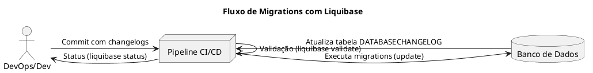

# Liquibase – Controle de Migrations

## ✅ O que é Liquibase?
O **Liquibase** é uma ferramenta open source para versionamento e automação de alterações no banco de dados. Ele ajuda a manter **consistência entre ambientes**, integrando-se a pipelines de **CI/CD**.

---

## ✅ Problema
- Scripts SQL manuais e desorganizados.
- Ambientes desatualizados ou fora de sincronia.
- Falta de auditoria e rollback seguro.

---

## ✅ Solução
Liquibase oferece:
✔ Controle de versão via **changelogs**  
✔ Execução automatizada em CI/CD  
✔ Histórico completo no banco  
✔ Suporte a **XML, YAML, JSON e SQL**  

---

## ✅ Estrutura Recomendada
```
/migrations
  ├── db.changelog-master.yaml
  ├── 001-create-products.yaml
  ├── 002-add-created-at.yaml
  ├── liquibase.properties
```

---

## ✅ Arquivo liquibase.properties
```properties
changeLogFile=migrations/db.changelog-master.yaml
url=jdbc:postgresql://localhost:5432/mydb
username=postgres
password=secret
driver=org.postgresql.Driver
```

---

## ✅ Comandos Importantes
### **Inicialização**
```bash
liquibase init project
```

### **Validar configurações**
```bash
liquibase --defaultsFile=migrations/liquibase.properties validate
```

### **Verificar status**
```bash
liquibase --defaultsFile=migrations/liquibase.properties status --verbose
```

### **Gerar SQL sem aplicar**
```bash
liquibase --defaultsFile=migrations/liquibase.properties updateSQL
```

### **Aplicar migrations**
```bash
liquibase --defaultsFile=migrations/liquibase.properties update
```

### **Rollback**
```bash
# Voltar 1 alteração
liquibase --defaultsFile=migrations/liquibase.properties rollbackCount 1

# Voltar até uma TAG
liquibase --defaultsFile=migrations/liquibase.properties rollback my_tag
```

---

## ✅ Exemplo com YAML
**Arquivo:** `db.changelog-master.yaml`
```yaml
databaseChangeLog:
  - changeSet:
      id: 001
      author: acnaweb
      changes:
        - createTable:
            tableName: products
            columns:
              - column:
                  name: id
                  type: BIGINT
                  autoIncrement: true
                  constraints:
                    primaryKey: true
              - column:
                  name: name
                  type: VARCHAR(255)
              - column:
                  name: price
                  type: DECIMAL(10,2)

  - changeSet:
      id: 002
      author: acnaweb
      changes:
        - addColumn:
            tableName: products
            columns:
              - column:
                  name: created_at
                  type: TIMESTAMP
                  defaultValueComputed: CURRENT_TIMESTAMP
```

---

## ✅ Pipeline CI/CD (GitHub Actions)
Crie `.github/workflows/liquibase.yml`:
```yaml
name: Liquibase Migration

on:
  push:
    branches:
      - main

jobs:
  migrate:
    runs-on: ubuntu-latest
    steps:
      - name: Checkout código
        uses: actions/checkout@v3

      - name: Configurar JDK
        uses: actions/setup-java@v3
        with:
          distribution: 'temurin'
          java-version: '17'

      - name: Instalar Liquibase
        run: |
          curl -sLo liquibase.tar.gz https://github.com/liquibase/liquibase/releases/download/v4.23.2/liquibase-4.23.2.tar.gz
          tar -xzf liquibase.tar.gz
          sudo mv liquibase /usr/local/bin/liquibase

      - name: Executar migrations
        run: |
          liquibase --defaultsFile=migrations/liquibase.properties update
```

---

## ✅ Exemplo com BigQuery
**Arquivo liquibase.properties para BigQuery**
```properties
changeLogFile=migrations/db.changelog-master.yaml
url=jdbc:bigquery://https://www.googleapis.com/bigquery/v2:443;ProjectId=my-project;OAuthType=0;OAuthServiceAcctEmail=my-service-account@project.iam.gserviceaccount.com;OAuthPvtKeyPath=/path/key.json
driver=com.simba.googlebigquery.jdbc.Driver
```

**ChangeSet YAML:**
```yaml
databaseChangeLog:
  - changeSet:
      id: 001
      author: acnaweb
      changes:
        - createTable:
            tableName: sales_data
            columns:
              - column:
                  name: sale_id
                  type: STRING
              - column:
                  name: amount
                  type: FLOAT64
              - column:
                  name: created_at
                  type: TIMESTAMP
```

---

## ✅ Fluxo Visual (PlantUML)



---

## ✅ Alternativas
- **Flyway** → mais simples e baseado em SQL.  
- **Alembic** → para projetos Python.  

---

# Diversos

* DBMS

- https://docs.liquibase.com/concepts/changelogs/attributes/dbms.html

* SQL Formats

- https://docs.liquibase.com/concepts/changelogs/sql-format.html

* Variables

- https://docs.liquibase.com/concepts/changelogs/property-substitution.html

* Databases

- https://contribute.liquibase.com/extensions-integrations/directory/database-tutorials/

## Grants

```sh
# Concede permissão para criar jobs
gcloud projects add-iam-policy-binding study-gcp-398200 \
  --member="serviceAccount:study-gcp-398200@appspot.gserviceaccount.com" \
  --role="roles/bigquery.jobUser"

# Concede permissão para alterar dados e tabelas
gcloud projects add-iam-policy-binding study-gcp-398200 \
  --member="serviceAccount:study-gcp-398200@appspot.gserviceaccount.com" \
  --role="roles/bigquery.dataEditor"
```

## References

- https://www.liquibase.com/